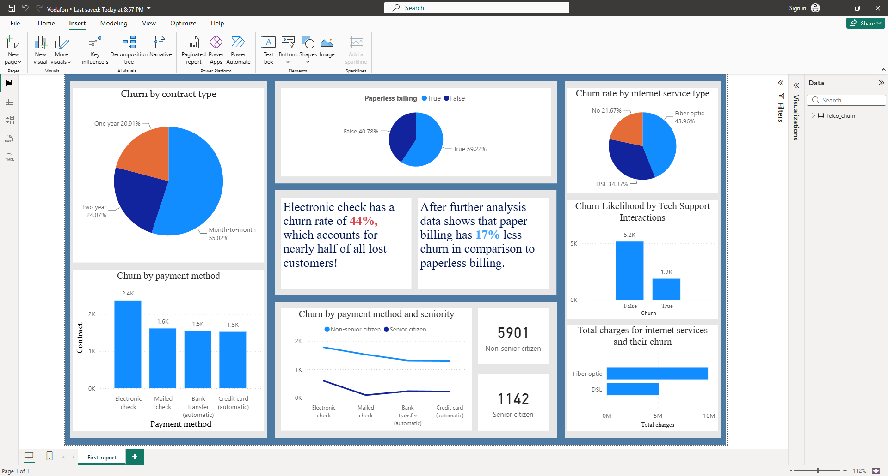

# Telco Customer Churn — Power BI Analysis

A single-page Power BI report analysing customer churn drivers using the IBM Telco dataset. Focuses on hypothesis testing, payment method risk, and visual storytelling.

---

## Key Insights

- **Electronic check users carry a 44% churn rate** — nearly half of all lost customers in the dataset
- **Paper billing yields 17% less churn** in comparison to paperless billing — a clear divergence in digital vs traditional billing retention
- **Longer contract duration strongly correlates with lower churn** — month-to-month contracts show the highest risk at **55.02%**, while two-year contracts drop to **24.07%**
- **Higher tech support engagement correlates with lower churn** — customers without support account for **5.2K** churn instances vs **1.9K** with support
- **Demographic distribution:** 5,901 non-senior and 1,142 senior citizens monitored, showing distinct behavioral variances across payment choices

## Methodology

**Data cleaning (DAX):**
- Normalised `Yes/No` and `1/0` columns to `TRUE/FALSE`
- Replaced NULL `TotalCharges` with 0 for aggregation

**Hypothesis testing sequence (DAX measures behind the report):**
1. Formed assumption: seniors prefer automatic credit card billing (stability signal)
2. Data disproved it: 36% of seniors using ACCB churn vs 15% non-senior
3. Counter-discovery: both groups churn most on electronic check
4. Concluded: even logical assumptions must be validated

**Layout design:**
- Single-page report with 8 visualisations clustered by theme
- Spacer cubes used for precise alignment — intentional breathing room between tiles

## Files

| File | Purpose |
|---|---|
| `Vodafon.pbix` | Full Power BI report with DAX measures |
| `README.md` | This file |

---

**Philosophy:** *"Humility through hypothesis validation — form assumptions, test them, accept when data says you're wrong."*
